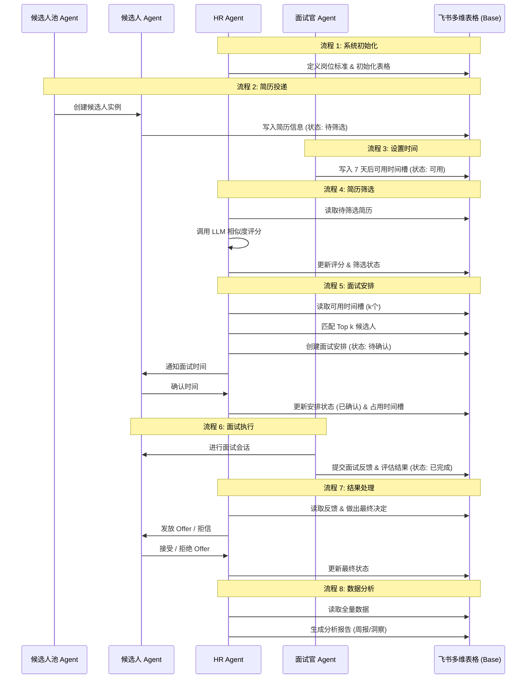

# 虚拟员工系统设计

## 一、系统概述

本系统构建一个由三个AI Agent组成的虚拟招聘组织，通过飞书多维表格进行数据管理，实现完整的招聘流程。

### 约束条件

- 每天最多上午（10:00-12:00）、下午（14:00-17:00）、晚上（19:00-21:00）各预约一场时长为1小时的面试
- 面试开始时间必须为整半小时
- 最长预约一周内的面试

### 系统简化说明

- 只有一名HR Agent为一名面试官Agent招聘一个岗位的n个候选人（n在1-5之间，系统启动时配置）
- 一个候选人只能至多参加一次面试
- 只有一个固定的岗位筛选标准（模板）

## 二、虚拟员工建模

### 1. HR Agent

#### 角色职责定义

- 管理招聘流程，维护岗位筛选标准
- 将（岗位筛选标准，简历）对交由大模型进行相似度评分
- 基于评分结果筛选出符合岗位要求的候选人
- 根据面试官可面试时间表格中的可面试时间，为每个候选人Agent安排面试
- 收集面试反馈，进行最终评估
- 发放Offer通知
- 生成招聘分析报告

#### 输入/输出说明

- **输入**：
  - 候选人简历信息
  - 面试官可面试时间
  - 面试反馈
- **输出**：
  - 筛选结果（候选人评分）
  - 面试安排信息
  - Offer通知
  - 招聘分析报告

### 2. 面试官 Agent

#### 角色职责定义

- 在当天所有面试结束后，向面试官可面试时间表格中写入7天后当日的可面试时间
- 接收面试安排通知
- 准备面试问题和评估标准
- 进行面试并记录面试过程
- 基于面试表现给出评估意见
- 提交面试反馈

#### 输入/输出说明

- **输入**：
  - 面试安排信息
  - 候选人简历
- **输出**：
  - 可面试时间（7天后的）
  - 面试反馈
  - 候选人评估结果

### 3. 候选人池 Agent

#### 角色职责定义

- 动态随机创建新的候选人Agent
- 将简历信息存入简历池表格

#### 输入/输出说明

-  
  ## **输入**：
- **输出**：
  - 新创建的候选人Agent

### 4. 候选人 Agent（由候选人池动态创建）

#### 角色职责定义

- 候选人信息写入简历池
- 接收面试安排通知
- 确认或拒绝面试安排
- 参加面试
- 接收面试结果和Offer
- 接受或拒绝Offer

#### 输入/输出说明

- **输入**：
  - 面试安排信息
  - 面试问题
  - 面试结果通知
  - Offer通知
- **输出**：
  - 面试安排确认
  - 面试回答
  - Offer接受/拒绝回复

### 三、业务系统构建

### 1. 飞书多维表格设计

#### 1.1 简历池表格

- **用途**：存储和管理所有候选人信息
- **字段设计**：
  - 候选人ID（主键）
  - 姓名
  - 性别
  - 年龄
  - 学历
  - 工作经验
  - 技能标签
  - 简历内容
  - 投递时间
  - 筛选状态（待筛选/已筛选/通过/不通过）
  - 相似度评分
  - 面试状态（待面试/已面试/通过/不通过）
  - Offer状态（待发放/已发放/已接受/已拒绝）
  - 岗位筛选标准（包含所需技能、经验等要求）

#### 1.2 面试官可面试时间表格

- **用途**：管理面试官可面试时间
- **字段设计**：
  - 时间记录ID（主键）
  - 面试官ID
  - 日期
  - 时段（上午/下午/晚上）
  - 可用状态（可用/已占用）
  - 更新时间

#### 1.3 面试安排表格

- **用途**：记录和管理面试安排
- **字段设计**：
  - 面试ID（主键）
  - 候选人ID（关联简历池）
  - 面试官ID
  - 面试时间（开始时间）
  - 面试时长
  - 面试状态（待进行/进行中/已完成）
  - 面试反馈
  - 评估结果
  - 安排状态（待确认/已确认/已取消）

#### 1.4 数据分析表格

- **用途**：汇总和分析招聘数据
- **字段设计**：
  - 报告ID（主键）
  - 报告类型（日报/周报/月报）
  - 报告内容
  - 生成时间

### 2. 表间关系

- 简历池与面试安排表：一对一关系（一个候选人只参加一次面试）
- 面试官可面试时间与面试安排表：一对多关系（一个面试官可进行多次面试，每次面试占用一个时间槽）

## 四、业务运行与协同

### 1. 完整业务流程

### 2. 详细业务流程

#### 流程1：系统初始化

- **执行Agent**：HR Agent
- **步骤**：
  1. HR Agent定义岗位筛选标准
  2. HR Agent初始化所有飞书表格

#### 流程2：候选人简历投递

- **执行Agent**：候选人池Agent、候选人Agent
- **步骤**：
  1. 候选人池Agent创建候选人Agent
  2. 候选人Agent提交简历
  3. 候选人Agent将简历信息写入简历池表格

#### 流程3：面试官设置可面试时间

- **执行Agent**：面试官Agent
- **步骤**：
  1. 面试官Agent完成当天所有面试
  2. 面试官Agent确定7天后当日的可面试时间
  3. 面试官Agent将可面试时间写入面试官可面试时间表格
  4. 面试官Agent标记可用状态为"可用"

#### 流程4：简历筛选

- **执行Agent**：HR Agent
- **步骤**：
  1. HR Agent定期检查简历池表格
  2. HR Agent使用固定的岗位筛选标准
  3. HR Agent将（岗位筛选标准，简历）对交由大模型进行相似度评分
  4. HR Agent根据评分结果进行筛选
  5. HR Agent更新简历池表格中的筛选状态和相似度评分

#### 流程5：面试安排

- **执行Agent**：HR Agent
- **方案说明**：候选人不需要提前填写可面试时间偏好，HR Agent根据面试官提供的可面试时间和候选人评分直接安排，候选人Agent只需确认或拒绝安排的时间。
- **详细步骤**：
  1. HR Agent从面试官可面试时间表格中读取接下来一周内的可用时间
  2. HR Agent统计可用时间段总数k
  3. HR Agent从简历池表格中挑选评分最高的、筛选通过且未安排面试的至多k个候选人
  4. HR Agent按评分从高到低依次为候选人分配可用时间槽
  5. HR Agent创建面试安排记录，状态为"待确认"
  6. HR Agent通知对应的候选人和面试官
  7. 候选人Agent确认或拒绝面试安排
  8. 如确认，HR Agent更新面试安排状态为"已确认"，并标记面试官可面试时间为"已占用"
  9. 如拒绝，HR Agent释放该时间槽，尝试为候选人安排下一个可用时间，或放入等待队列

#### 流程6：面试执行

- **执行Agent**：面试官Agent、候选人Agent
- **步骤**：
  1. 面试官Agent接收面试安排通知
  2. 面试官Agent准备面试问题和评估标准
  3. 候选人Agent接收面试安排通知
  4. 候选人Agent准备面试
  5. 面试官Agent进行面试并记录过程
  6. 面试官Agent提交面试反馈和评估结果
  7. 面试官Agent更新面试状态为"已完成"

#### 流程7：结果处理

- **执行Agent**：HR Agent
- **步骤**：
  1. HR Agent收集和分析面试反馈
  2. HR Agent做出最终评估决定
  3. HR Agent更新简历池表格中的面试状态
  4. 对通过面试的候选人，HR Agent发放Offer
  5. 对未通过的候选人，HR Agent发送通知
  6. HR Agent更新Offer状态

#### 流程8：数据分析

- **执行Agent**：HR Agent
- **步骤**：
  1. HR Agent定期（如每周）从所有表格中读取数据
  2. HR Agent进行数据分析：
     - 招聘漏斗分析：简历投递 → 筛选通过 → 面试 → Offer → 入职
     - 面试官评估分布分析
     - 招聘周期分析
  3. HR Agent生成数据洞察和决策建议
  4. HR Agent将报告写入数据分析表格

## 五、Agent 生命周期

### 1. HR Agent (长期驻留)

- **创建**：系统启动时初始化，加载岗位标准和飞书配置。
- **运行**：定时轮询简历池、面试时间表和面试反馈。
- **更新**：根据业务逻辑更新 Base 状态，生成分析报告。
- **销毁**：确认招聘n名候选人Agent后停止招聘流程。

### 2. 面试官 Agent (长期驻留)

- **创建**：系统启动时初始化，绑定特定的面试官 ID。
- **运行**：监听面试安排通知，并在每日面试结束后自动更新未来可面试时间。
- **更新**：在 Base 中回填面试评估和反馈。
- **销毁**：HR Agent确定结束招聘流程后。

### 3. 候选人池 Agent (工厂模式)

- **创建**：系统启动时初始化，作为管理中心。
- **运行**：监听“新简历提交”触发器或由主循环调用以模拟候选人加入。
- **更新**：负责生成新的候选人 Agent 实例并维护其列表。
- **销毁**：系统停止时关闭。

### 4. 候选人 Agent (动态创建/销毁)

- **创建**：由候选人池 Agent 在收到新简历时动态实例化。
- **运行**：代表特定候选人，负责确认面试安排、模拟面试回答、接受/拒绝 Offer。
- **更新**：向 Base 写入个人状态变更（如确认面试）。
- **销毁**：在完成入职（接受 Offer）或被淘汰（拒信/拒绝 Offer）并完成数据持久化后，由管理中心回收并销毁。

## 六、数据分析与报告

### 1. 数据分析内容

- **招聘漏斗分析**：跟踪从简历投递到Offer的转化率
- **面试官评估分布**：分析面试官评分的分布情况
- **招聘效率分析**：统计招聘周期和成功率
- **候选人质量分析**：基于评分和最终结果的分析

### 2. 报告输出形式

- **周报**：每周生成，包括本周招聘进展、关键指标分析
- **数据洞察**：定期生成，包括招聘效率、候选人质量评估
- **决策建议**：基于数据分析结果，提供优化建议

### 3. 实现方式

- HR Agent定期从飞书表格读取数据
- HR Agent使用逻辑计算或调用大模型进行分析
- HR Agent将分析结果写入数据分析表格
- 报告以结构化形式存储，便于查看和分享

## 七、技术实现要点

### 1. Agent间协同机制

- 所有数据通过飞书多维表格进行传递和共享
- Agent通过飞书多维表格OpenAPI进行数据操作
- Agent定期检查表格变化，触发相应的业务流程

### 2. 飞书表格API操作

- **读取数据**：Agent通过API获取表格数据
- **更新状态**：Agent通过API更新表格中的状态字段
- **写入结果**：Agent通过API向表格写入新记录或更新记录

### 3. 大模型使用

- 统一使用国内大模型
- 使用提示词工程优化模型表现
- 通过工具调用编排实现复杂业务逻辑
- 不进行模型微调

