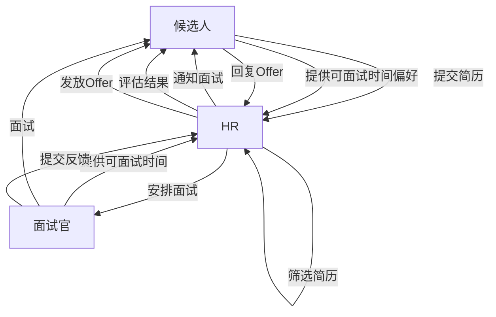
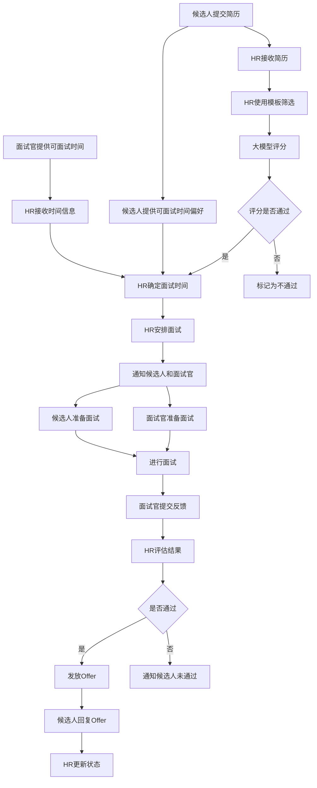

# 虚拟员工系统设计

## 一、身份确定

### 约束条件：
- 每天最多上午（10:00-12:00）、下午（14:00-17:00）、晚上（19:00-21:00）各预约一场时长为1小时的面试
- 面试开始时间必须为整半小时
- 最长预约一周内的面试

## 二、虚拟员工建模

### 1. HR 角色

#### 角色职责定义：
- 管理候选人池，维护候选人信息
- 使用筛选模板对简历进行初步筛选
- 将（模板，简历）对交由大模型进行相似度评分
- 基于评分结果，筛选出符合要求的候选人
- 协调面试官时间，安排面试
- 管理面试流程和状态
- 收集面试反馈，进行最终评估
- 发放Offer通知

#### 输入 / 输出说明：
- **输入**：
  - 候选人简历信息
  - 筛选模板
  - 面试官可面试时间
  - 面试反馈
- **输出**：
  - 筛选结果（候选人评分）
  - 面试安排信息
  - 面试状态更新
  - Offer通知

### 2. 面试官角色

#### 角色职责定义：
- 提供可面试时间范围
- 接收面试安排通知
- 准备面试问题和评估标准
- 进行面试并记录面试过程
- 基于面试表现给出评估意见
- 提交面试反馈

#### 输入 / 输出说明：
- **输入**：
  - 面试安排信息
  - 候选人简历
  - 面试评估模板
- **输出**：
  - 可面试时间
  - 面试反馈
  - 候选人评估结果

### 3. 候选人角色

#### 角色职责定义：
- 提交个人简历
- 提供可面试时间偏好
- 接收面试安排通知
- 参加面试
- 接收面试结果和Offer

#### 输入 / 输出说明：
- **输入**：
  - 面试安排信息
  - 面试问题
  - 面试结果通知
- **输出**：
  - 个人简历
  - 可面试时间偏好
  - 面试回答
  - Offer接受/拒绝回复

### 4. 角色间协作关系

## 三、业务系统构建

### 1. 数据表设计

#### 1.1 候选人表
- **字段设计**：
  - 候选人ID（主键）
  - 姓名
  - 性别
  - 年龄
  - 学历
  - 工作经验
  - 技能标签
  - 简历内容
  - 投递时间
  - 筛选状态（待筛选/已筛选/通过/不通过）
  - 相似度评分
  - 面试状态（待面试/已面试/通过/不通过）
  - Offer状态（待发放/已发放/已接受/已拒绝）
  - 可面试时间偏好（JSON格式，存储每天的可面试时段偏好）

#### 1.2 面试官表
- **字段设计**：
  - 面试官ID（主键）
  - 姓名
  - 部门
  - 职位
  - 擅长领域
  - 可面试时间（JSON格式，存储每天的可面试时段）

#### 1.3 面试安排表
- **字段设计**：
  - 面试ID（主键）
  - 候选人ID（关联候选人表）
  - 面试官ID（关联面试官表）
  - 面试时间（开始时间）
  - 面试时长
  - 面试状态（待进行/进行中/已完成）
  - 面试反馈
  - 评估结果
  - 安排状态（待确认/已确认/已取消）

#### 1.4 筛选模板表
- **字段设计**：
  - 模板ID（主键）
  - 模板名称
  - 模板内容（包含所需技能、经验等要求）
  - 创建时间
  - 更新时间

### 2. 表间关系
- 候选人表与面试安排表：一对多关系（一个候选人可参加多次面试）
- 面试官表与面试安排表：一对多关系（一个面试官可进行多次面试）
- 筛选模板表与候选人表：一对多关系（一个模板可用于筛选多个候选人）

## 四、业务运行与协同

### 1. 完整业务流程

### 2. 面试时间确定流程

#### 2.1 时间收集
- **面试官**：提供一周内的可面试时间，按照上午（10:00-12:00）、下午（14:00-17:00）、晚上（19:00-21:00）三个时段划分
- **候选人**：提供个人可面试时间偏好，同样按照三个时段划分

#### 2.2 时间匹配算法
1. **步骤1**：HR从面试官表中获取面试官的可面试时间
2. **步骤2**：HR从候选人表中获取候选人的可面试时间偏好
3. **步骤3**：根据约束条件筛选可用时间：
   - 每天每个时段最多安排一场面试
   - 面试开始时间必须为整半小时
   - 最长预约一周内的面试
   - 面试时长为1小时
4. **步骤4**：优先选择面试官和候选人都可用的时间段
5. **步骤5**：如果没有完全匹配的时间，则根据候选人的偏好和面试官的可用时间进行协调
6. **步骤6**：确定面试时间后，更新面试安排表

#### 2.3 时间安排示例
假设当前日期为2026年4月24日，面试官的可面试时间如下：
- 4月25日（周一）：上午10:00-12:00，下午14:00-17:00
- 4月26日（周二）：晚上19:00-21:00
- 4月27日（周三）：上午10:00-12:00，下午14:00-17:00，晚上19:00-21:00

候选人A的时间偏好：
- 4月25日（周一）：下午14:00-17:00
- 4月26日（周二）：晚上19:00-21:00
- 4月27日（周三）：上午10:00-12:00

HR的时间安排过程：
1. 检查4月25日下午是否可用：面试官和候选人都可用，安排在14:00-15:00
2. 记录到面试安排表，状态为"待确认"
3. 通知候选人和面试官
4. 收到确认后，更新状态为"已确认"

### 3. 技术实现
- Agent 通过飞书多维表格 OpenAPI：
  - 读取数据：获取候选人信息、面试官可面试时间、候选人时间偏好、面试安排等
  - 更新状态：更新候选人筛选状态、面试状态、Offer状态、安排状态等
  - 写入结果：写入筛选结果、面试反馈、评估结果、面试安排等
  - 时间处理：使用日期时间库处理时间匹配和验证

## 五、数据分析与报告

### 1. 数据自动分析
- 招聘漏斗分析：简历投递 → 筛选通过 → 面试 → Offer → 入职
- 面试官评估分布分析
- 候选人来源分析
- 招聘周期分析

### 2. 报告输出
- 周报：每周招聘进展、关键指标分析
- 数据洞察：招聘效率、候选人质量评估
- 决策建议：优化招聘流程、调整筛选标准

## 六、写作流程

### 1. 需求分析
- 理解赛事要求，确定系统目标
- 分析业务流程，识别关键角色和任务

### 2. 角色建模
- 定义HR、面试官、候选人三个核心角色
- 明确每个角色的职责、输入输出
- 设计角色间协作关系

### 3. 系统设计
- 设计数据表结构和字段
- 建立表间关联关系
- 设计业务流程和状态流转

### 4. 技术实现规划
- 确定使用飞书多维表格 OpenAPI 进行数据操作
- 设计API调用流程和数据交互方式
- 规划Agent间的协同机制

### 5. 数据分析设计
- 确定关键指标和分析维度
- 设计报告模板和输出形式

### 6. 文档编写
- 整理系统设计文档
- 编写技术实现方案
- 准备测试和演示材料

## 七、需要的飞书表格

### 1. 候选人管理表
- 用途：存储和管理所有候选人信息
- 核心字段：候选人基本信息、简历内容、筛选状态、面试状态、Offer状态

### 2. 面试官管理表
- 用途：管理面试官信息和可面试时间
- 核心字段：面试官基本信息、可面试时间、擅长领域

### 3. 面试安排表
- 用途：记录和管理面试安排
- 核心字段：面试时间、参与人员、面试状态、反馈结果

### 4. 筛选模板表
- 用途：存储和管理简历筛选模板
- 核心字段：模板内容、适用岗位、创建时间

### 5. 数据分析表
- 用途：汇总和分析招聘数据
- 核心字段：招聘漏斗数据、关键指标、趋势分析

### 6. 报告输出表
- 用途：生成和存储招聘报告
- 核心字段：报告类型、生成时间、报告内容
